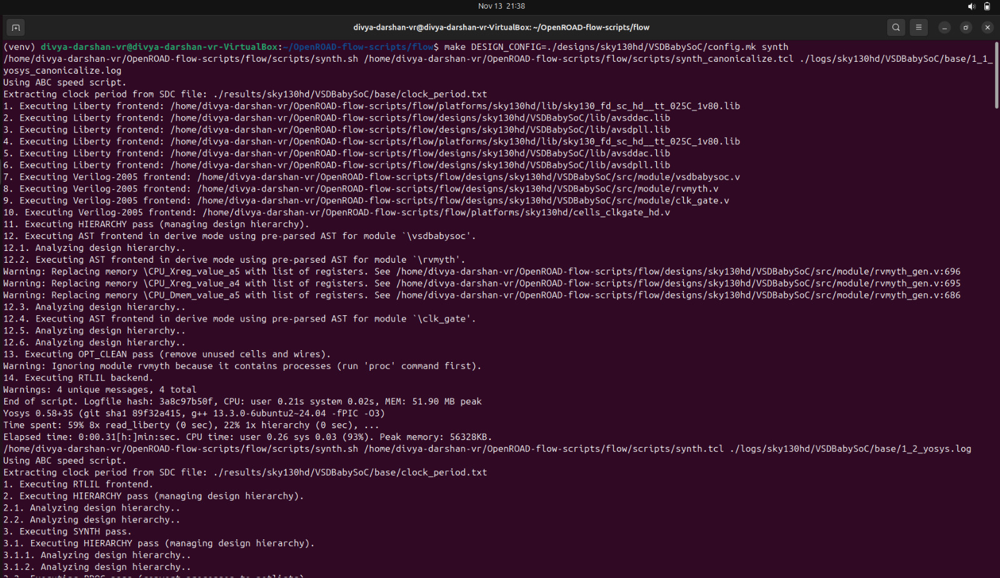

# Synthesis Stage — VSDBabySoC
---
## Objective

- Convert RTL to gate-level netlist
- Ensure timing/area constraints are met
- Generate synthesis reports
---

## Commands Used

```bash
# Move to this directory
cd ~/OpenROAD-flow-scripts/flow

# Run this Command
make DESIGN_CONFIG=./designs/sky130hd/VSDBabySoC/config.mk synth
```
- The above command will run upto Synthesis and ABC mapping.
---
## Terminal Screenshot




---
## Synthesis Summary (vsdbabysoc)

| Metric                                   | Value                      | Notes / Source |
|------------------------------------------|-----------------------------|----------------|
| **Total Cell Count**                     | 5913 cells                  | Technology-mapped netlist |
| **Total Sequential Cells**               | 1144 cells                  | `sky130_fd_sc_hd__dfxtp_1` flops |
| **Total Combinational Cells**            | 4769 cells                  | 5913 − 1144 |
| **Total Reported Chip Area**             | 52,874.4608 µm²             | From synthesis report |
| **Sequential Cell Area**                 | 22,901.9648 µm²             | Provided by tool |
| **Sequential Area (%)**                  | 43.31%                      | Sequential area ÷ total area |
| **Memory Blocks**                        | 0                           | No memories inferred |
| **Custom Macros Used**                   | 2 (`avsddac`, `avsdpll`)    | 1 instance each |
| **Unknown Macro Area Warning**           | Yes                         | `Area for avsddac / avsdpll is unknown` |
| **Largest Cell Categories**              | NAND2, O21AI, A21OI, FFs    | High count cells indicate logic style |
| **Design Hierarchy Depth**               | vsdbabysoc → rvmyth → clk_gate | From hierarchy report |

---
## Insights from the Synthesis Report

| **Aspect** | **Insight Gained** | **Importance** |
|-----------|---------------------|----------------|
| **Design Hierarchy** | Shows structure: `vsdbabysoc → rvmyth → clk_gate` | Confirms correct RTL integration and module connections |
| **Cell Count Breakdown** | Total cells = 5913; Sequential = 1144; Combinational = 4769 | Essential for estimating area, timing, and power |
| **Flip-Flop Usage** | 1144 DFFs inferred | Indicates register usage, pipeline depth, and sequential load |
| **Combinational Logic Density** | ~4769 logic cells (NAND, NOR, AOI, OAI, MUX, etc.) | Impacts timing closure and routing congestion |
| **Custom Macro Presence** | `avsddac` and `avsdpll` each appear once | Must provide LEF/LIB/GDS for clean physical design |
| **Macro Area Unknown Warning** | Tool reports area not defined for macros | Needs fixing for accurate floorplan and utilization |
| **Total Area Reported** | 52,874.4608 µm² | Helps set die/core size during floorplanning |
| **Sequential Area Contribution** | 43.31% of total area (22,901 µm²) | Valuable for power estimation and clock tree planning |
| **Standard Cell Variety** | High count of NAND, OAI, AOI, etc. | Reveals logic style and influences timing paths |
| **Clock-related Cells** | 568 `clkinv` cells inferred | Determines clock tree load and CTS complexity |
| **Memory Inference Check** | No memories inferred | Ensures RTL didn’t unintentionally create latches or RAM |
| **Wire & Port Count** | Thousands of wires and bits; 7 ports | Indicates netlist complexity and routing demand |
| **Technology Mapping Quality** | `$AND`, `$MUX`, `$OR` → mapped to sky130 standard cells | Ensures correct synthesis for the target PDK |

---
## Conclusion

- The synthesis stage successfully converted the RTL into a gate-level netlist using Sky130 cells, confirming logical correctness.
- Key metrics such as cell count, area, and utilization were analyzed to ensure the design fits within technology constraints.
- This stage provides a validated structural blueprint for the physical design flow, enabling smooth progression to floorplanning.
---