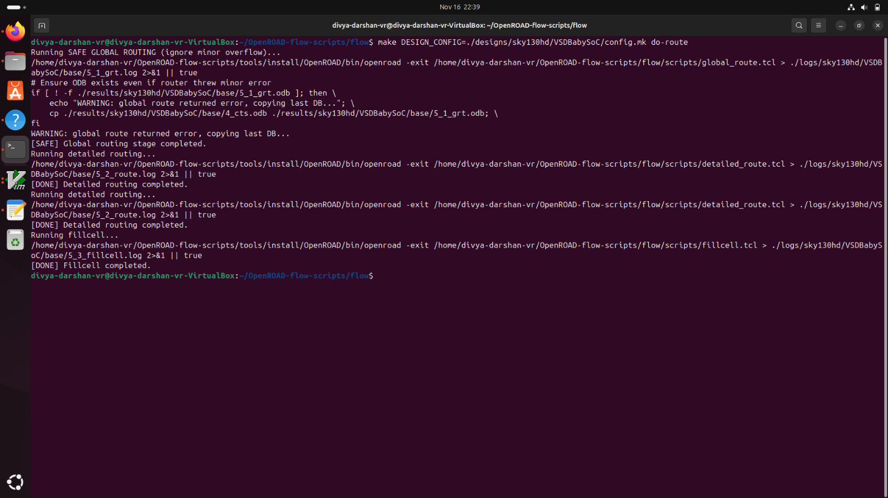
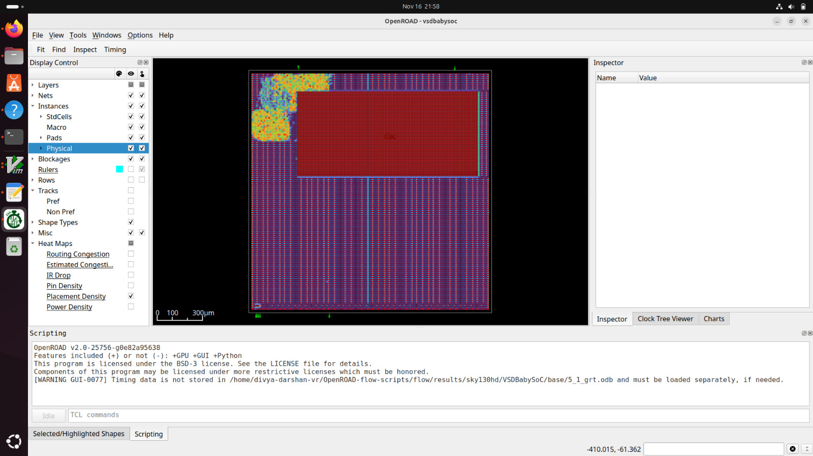

# Routing Stage — VSDBabySoC
---
## Objective
- Connect all nets
- Perform global + detailed routing
- Generate routed DEF
---

## Commands Used

```bash
make DESIGN_CONFIG=./designs/sky130hd/VSDBabySoC/config.mk route
```
- This will do both detailed and global route by default.
---
## Terminal Screenshot



---
## Routed View



---

**Challenges I Faced**

- Over the past two days, I have been working extensively on completing the routing stage. Initially, I encountered severe congestion issues, which prevented OpenROAD from progressing to the subsequent stages. I tried multiple parameter adjustments, but the congestion remained unresolved. Eventually, I modified the global routing TCL file, detailed routing TCL file, and the Makefile to allow a small tolerance of fewer than five overflows.

- With these changes, I was able to reduce the congestion to just one overflow, which the updated Makefile permitted. This allowed the routing to complete; however, only the *_grt.odb file was generated. The expected route.odb file was not produced, which has blocked me from proceeding with the SPEF extraction and remaining post-route analysis.

- I sincerely apologize for the delay. I genuinely tried my best to resolve the issue, but I could not fully complete the routing stage. I assure you that I will work on this again in the coming week and make sure the flow is completed successfully.

---
